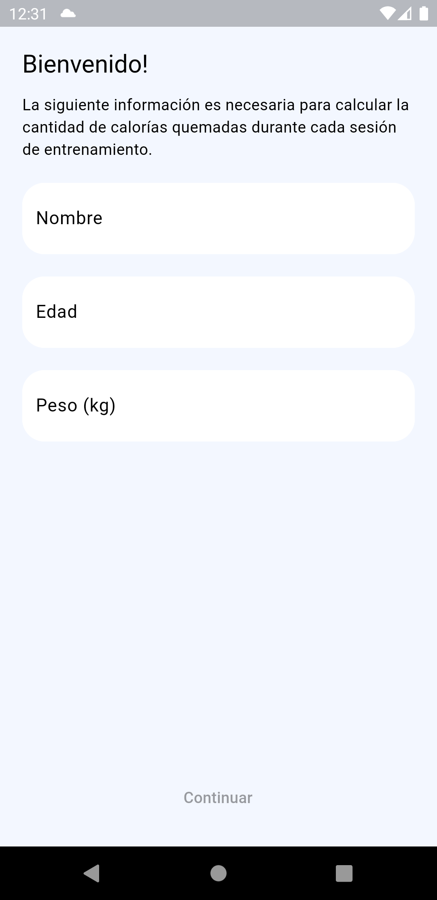
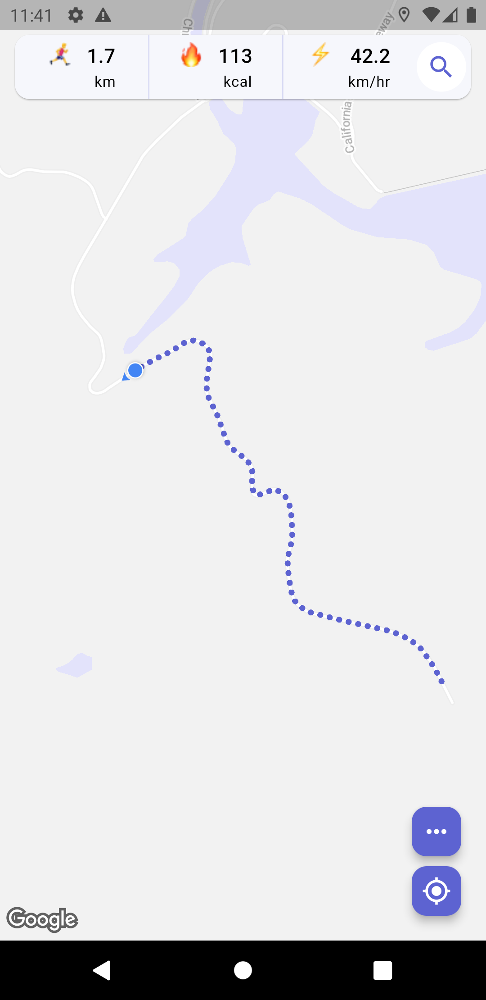
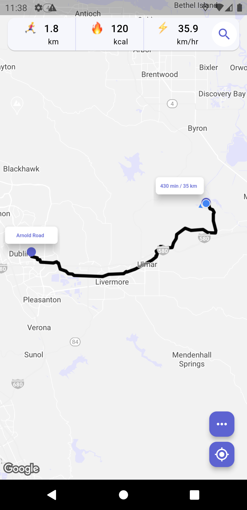
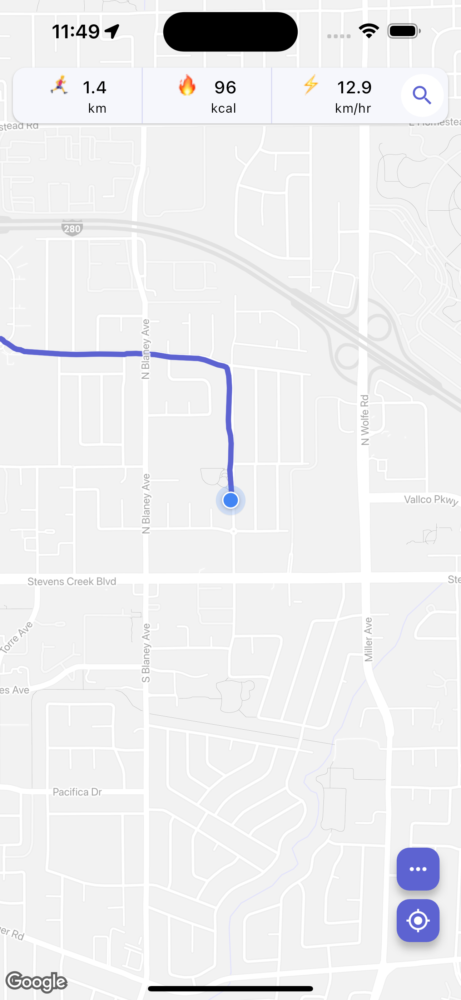
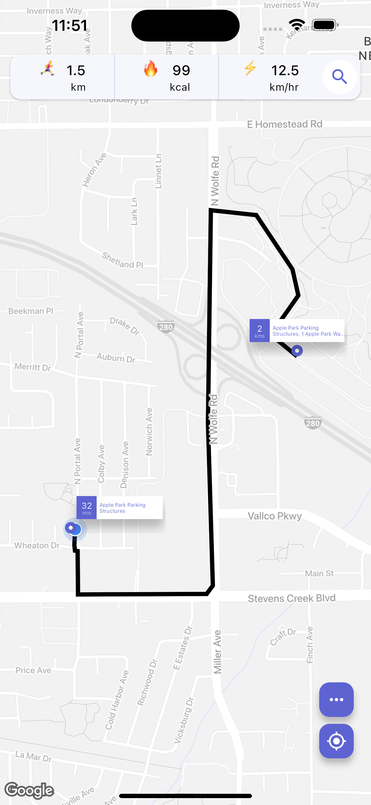

# Jogging App

This Flutter application is designed for jogging enthusiasts, offering a range of features to enhance the running experience.

## Key Features:

1. Google Maps Integration

Seamless integration of Google Maps for an interactive and detailed view of jogging routes.

2. Location Tracking and Route Management

Real-time tracking of user location during jogging sessions.
Save and display jogging routes with the ability to show/hide route polylines.

3. Autofocus Camera

Autofocus on the map's camera with each new location update, providing a smooth and dynamic experience.

4. Fitness Statistics

Calculate total distance covered, estimated calories burned (based on distance), and running speed.

5. Route Navigation

Navigate to a specific location set either on the map or through the search functionality.
Utilizes Mapbox API for route information and nearby places, offering a free alternative with a limit of 100,000 monthly requests.

6. Custom Map Markers

Personalized markers on the map for enhanced visual representation.

7. Map Styling Configuration

Customize the map's appearance according to user preferences.

## Screenshots

**Onboarding:**

     
     

**Android:**

     
     
     

**iOS:**

